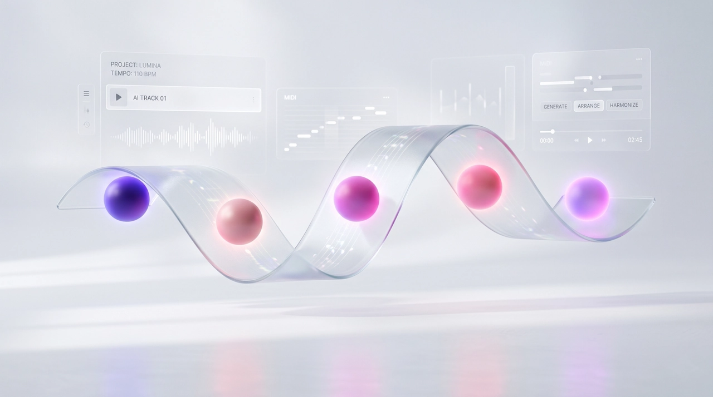

<picture>
  <source media="(prefers-color-scheme: dark)" srcset="web-app/public/images/hero-banner-dark.webp">
  <source media="(prefers-color-scheme: light)" srcset="web-app/public/images/hero-banner-light.webp">
  
</picture>

<h1 align="center">Sonauto — Sonata, Automated.</h1>

<p align="center">
  A full-stack AI music generation SaaS. Describe your sound in plain words and walk away with a complete song — AI-written lyrics, an original melody, and unique cover artwork — all generated in minutes.
</p>

<p align="center">
  <a href="https://sonauto-three.vercel.app" target="_blank"><strong>🎵 Live Demo</strong></a>
  &nbsp;·&nbsp;
  <a href="https://math-to-dev.vercel.app" target="_blank">Portfolio</a>
  &nbsp;·&nbsp;
  <a href="https://github.com/KeepSerene" target="_blank">GitHub</a>
  &nbsp;·&nbsp;
  <a href="https://x.com/UsualLearner" target="_blank">Twitter / X</a>
</p>

<p align="center">
  
  
  
  
  
  
</p>

---

## 📸 Screenshots

|                             Light Mode                              |                             Dark Mode                             |
| :-----------------------------------------------------------------: | :---------------------------------------------------------------: |
|  |  |

---

## 🎵 Live Demo

**[https://sonauto-three.vercel.app](https://sonauto-three.vercel.app)**

> Sign up for free and receive **10 credits** (5 songs) immediately — no credit card required.  
> The app is a portfolio project. Payments run in **Polar sandbox mode** (test cards accepted, no real charges).

---

## Table of Contents

- [Overview](#-overview)
- [Features](#-features)
- [AI Models & Services](#-ai-models--services)
- [Tech Stack](#-tech-stack)
- [Architecture](#-architecture)
- [Project Structure](#-project-structure)
- [Security & Rate Limiting](#-security--rate-limiting)
- [Credit & Billing System](#-credit--billing-system)
- [Installation & Local Development](#-installation--local-development)
  - [Prerequisites](#prerequisites)
  - [1. Clone the Repository](#1-clone-the-repository)
  - [2. Web App Setup](#2-web-app-setup)
  - [3. Modal Workers Setup](#3-modal-workers-setup)
  - [4. Run Locally](#4-run-locally)
- [Environment Variables](#-environment-variables)
  - [Web App](#web-app-env)
  - [Modal Workers](#modal-workers-env)
- [Database Setup](#-database-setup)
- [Deployment](#-deployment)
- [Generation Modes](#-generation-modes)
- [Author](#-author)

---

## 🔭 Overview

Sonauto is an end-to-end AI music generation platform built as a production-grade portfolio project. A user describes a song — a genre, a mood, a story — and the system orchestrates three AI models in sequence to produce a fully finished track: structured lyrics, a synthesized audio file, and a matching piece of cover art.

The platform is split into two independently deployable units:

- **`web-app`** — A Next.js 15 application (App Router) handling auth, the UI, background job dispatch, and all user-facing features.
- **`modal-workers`** — A Python 3.12 Modal serverless worker that loads ACE-Step (audio generation) and SDXL-Turbo (thumbnail generation) onto GPU and exposes a single FastAPI-style endpoint that the web app calls.

The two services communicate over HTTP. The web app fires an Inngest background function which calls the Modal endpoint; Modal uploads the finished audio and thumbnail directly to Cloudflare R2 and returns the public URLs.

---

## ✨ Features

### Music Generation

- **Four generation modes** — Simple (vibe-only), Custom Auto (AI lyrics from theme), Custom Manual (bring your own lyrics), and Instrumental (no lyrics at all)
- **AI-structured lyrics** — Verses, choruses, bridges, intros, and outros scaled to the chosen song duration (15 s – 3 min)
- **Controllable duration** — Slider from 15 to 180 seconds in 15-second steps
- **Seed control** — Advanced option to lock in a specific generation seed for reproducible results
- **Style tags** — Genre, vocal type, instruments, mood, and BPM tags are auto-generated from the user's description and fed directly into ACE-Step
- **Indian subcontinent support** — Ghazal, Sufi, Bollywood, Qawwali, sitar, tabla, and related genres are explicitly supported in all prompts

### Track Management

- **Rename** tracks inline
- **Publish / Unpublish** — toggle community visibility
- **Delete** with smart refund logic (see [Credit System](#-credit--billing-system))
- **Download** as a high-quality WAV via time-limited, cryptographically signed R2 pre-signed URLs
- **View lyrics** with a one-click copy-to-clipboard action

### Audio Player

- Persistent floating player — survives page navigation within the app
- Seek bar, volume control, play/pause
- Sidebar-aware positioning (shifts right when sidebar is open)
- Download and lyrics access from the player itself

### Community

- Published tracks are visible to all users
- Unique listen count (once per user per track)
- Like / unlike tracks
- Category-based browsing (3 AI-generated tags per song)

### UX & Polish

- Full light/dark theme with system preference detection
- Skeleton loading states on all async content
- Toast notifications for all async actions (Sonner)
- Responsive across mobile, tablet, and desktop
- Breadcrumb navigation in the protected app header
- Frosted-glass sticky headers
- Custom audio equalizer and skeleton shimmer CSS animations

---

## 🤖 AI Models & Services

| Layer       | Model / Service                                                                        | Purpose                                                                                                                                                                  |
| ----------- | -------------------------------------------------------------------------------------- | ------------------------------------------------------------------------------------------------------------------------------------------------------------------------ |
| **Text**    | [Groq](https://groq.com) — `llama-3.3-70b-versatile`                                   | Generates style tags, lyrics, song title, and 3 genre categories from the user's description. Runs in parallel where possible.                                           |
| **Audio**   | [ACE-Step](https://github.com/ace-step/ACE-Step)                                       | Open-source music generation model. Takes a comma-separated style/tag prompt and structured lyrics and synthesises a full audio waveform. Runs on Modal (NVIDIA L4 GPU). |
| **Artwork** | [SDXL-Turbo](https://huggingface.co/stabilityai/sdxl-turbo) (`stabilityai/sdxl-turbo`) | Generates abstract, atmospheric album cover art from the style prompt. 2-step inference for fast generation. Runs on the same Modal container as ACE-Step.               |

### Groq Text Pipeline

Every generation runs four Groq calls (some in parallel):

1. **`generateTags`** — converts the user description into ACE-Step's comma-separated tag format (`"pop, upbeat, female vocal, acoustic guitar, 120 bpm"`)
2. **`generateLyrics`** — writes full, duration-scaled lyrics with `[verse]`, `[chorus]`, `[bridge]`, `[intro]`, `[outro]` markers (skipped for instrumental)
3. **`generateTitle`** — produces a short, punchy 2–5 word song title
4. **`extractCategories`** — returns exactly 3 genre/mood category tags as JSON for community browsing

---

## 🛠 Tech Stack

### Web App

| Category             | Technology                                                                             |
| -------------------- | -------------------------------------------------------------------------------------- |
| **Framework**        | [Next.js 15](https://nextjs.org) — App Router, React Server Components, Server Actions |
| **Language**         | TypeScript 5.8                                                                         |
| **Styling**          | [Tailwind CSS v4](https://tailwindcss.com)                                             |
| **UI Components**    | [shadcn/ui](https://ui.shadcn.com) (Radix UI primitives)                               |
| **Authentication**   | [Better Auth](https://better-auth.com) (email + password, session cookies)             |
| **Auth UI**          | [@daveyplate/better-auth-ui](https://github.com/daveyplate/better-auth-ui)             |
| **Database ORM**     | [Prisma](https://prisma.io) 6                                                          |
| **Database**         | [Neon](https://neon.tech) — serverless PostgreSQL (connection pooling + direct URL)    |
| **Env Validation**   | [@t3-oss/env-nextjs](https://env.t3.gg) (T3 App Stack)                                 |
| **Background Jobs**  | [Inngest](https://inngest.com) — event-driven, retryable job queue                     |
| **File Storage**     | [Cloudflare R2](https://cloudflare.com/r2) via AWS S3-compatible SDK                   |
| **Payments**         | [Polar](https://polar.sh) — one-time credit packs (sandbox)                            |
| **AI SDK**           | [Vercel AI SDK](https://sdk.vercel.ai) + `@ai-sdk/groq`                                |
| **State Management** | [Zustand](https://zustand-demo.pmnd.rs) (audio player global state)                    |
| **Notifications**    | [Sonner](https://sonner.emilkowal.ski)                                                 |
| **Icons**            | [Lucide React](https://lucide.dev)                                                     |
| **Theming**          | [next-themes](https://github.com/pacocoursey/next-themes)                              |
| **Font**             | Libre Franklin (Google Fonts, variable)                                                |

### Modal Workers

| Category           | Technology                                                                             |
| ------------------ | -------------------------------------------------------------------------------------- |
| **Runtime**        | [Modal](https://modal.com) — serverless GPU compute                                    |
| **Language**       | Python 3.12.3                                                                          |
| **GPU**            | NVIDIA L4 (per generation)                                                             |
| **Audio Model**    | ACE-Step (cloned from GitHub, pinned to `1bee4c9`)                                     |
| **Image Model**    | SDXL-Turbo via [Diffusers](https://github.com/huggingface/diffusers)                   |
| **Audio I/O**      | torchaudio + soundfile (WAV output)                                                    |
| **Storage Upload** | boto3 (S3-compatible Cloudflare R2)                                                    |
| **API Framework**  | Modal's built-in FastAPI endpoint (`@modal.fastapi_endpoint`)                          |
| **Model Cache**    | Modal persistent Volume (`sonauto-models-cache`) — avoids re-downloading on cold start |
| **Secrets**        | Modal named secrets (`sonauto-secret`)                                                 |

---

## 🏗 Architecture

```
User Browser
     │
     ▼
Next.js App (Vercel)
     │
     ├─ Better Auth ──────────────── Neon PostgreSQL (Prisma)
     │
     ├─ /api/generate (POST)
     │       │
     │       ├─ Rate limit check (DB count, rolling 24h window)
     │       ├─ Atomic credit deduction (updateMany WHERE credits >= 2)
     │       ├─ Song record created (status: "queued")
     │       └─ inngest.send("song/generate")
     │                   │
     │                   ▼
     │             Inngest Worker (background, retryable)
     │                   │
     │                   ├─ Step 1: mark song "generating"
     │                   ├─ Step 2: Groq — tags + lyrics + title + categories (parallel)
     │                   ├─ Step 3: save text content to DB
     │                   ├─ Step 4: step.fetch → Modal GPU endpoint
     │                   │               │
     │                   │               ├─ SDXL-Turbo → thumbnail → R2
     │                   │               └─ ACE-Step   → audio WAV → R2
     │                   └─ Step 5: save URLs, mark "completed"
     │
     ├─ Cloudflare R2 ─────────────── audio/*.wav + thumbnails/*.webp
     │
     └─ Polar (Sandbox) ────────────── Webhook → credit increment on order paid
```

The client polls for completion every 5 seconds via `router.refresh()` on the TracksFetcher Server Component. A 15-minute stale-song remediation pass runs on each poll tick and automatically refunds credits for jobs that never completed.

---

## 📁 Project Structure (Tentative!)

```
sonauto-ai-music-gen-saas/
│
├── web-app/                          # Next.js 15 application
│   ├── prisma/
│   │   └── schema.prisma             # Database schema
│   ├── public/
│   │   └── images/                   # Hero banners, favicon
│   └── src/
│       ├── app/
│       │   ├── (auth)/               # Auth route group
│       │   │   └── auth/
│       │   │       ├── layout.tsx    # Split-panel auth layout (branding + form)
│       │   │       └── [...all]/     # Better Auth UI catch-all
│       │   ├── (protected)/          # Protected route group
│       │   │   ├── layout.tsx        # Sidebar + header + audio player shell
│       │   │   ├── dashboard/        # User's track library
│       │   │   ├── generate/         # Generation panel + track feed
│       │   │   ├── billing/          # Credit purchase page
│       │   │   └── account/          # Account settings
│       │   ├── api/
│       │   │   ├── generate/
│       │   │   │   └── route.ts      # POST — rate limit, credit deduction, job dispatch
│       │   │   ├── auth/             # Better Auth handler
│       │   │   └── inngest/          # Inngest event handler
│       │   ├── layout.tsx            # Root layout (fonts, theme, providers)
│       │   ├── page.tsx              # Landing page
│       │   └── not-found.tsx         # Global 404
│       ├── components/
│       │   ├── audio-player/         # Floating persistent audio player
│       │   ├── landing/              # Hero, Features, HowItWorks, Pricing, Header, Footer
│       │   ├── tracks/               # TrackGenPanel, TracksFetcher, Tracks, TrackThumbnail
│       │   ├── theme/                # ThemeProvider, ThemeToggle
│       │   ├── auth/                 # Providers, SignOutClient
│       │   ├── ui/                   # shadcn/ui primitives
│       │   ├── AppHeader.tsx         # Sticky header with rate-limit badge
│       │   ├── AppSidebar.tsx        # Navigation + credit display + upgrade CTA
│       │   ├── AppBreadcrumbs.tsx    # Dynamic breadcrumbs from pathname
│       │   └── Logo.tsx
│       ├── inngest/
│       │   ├── client.ts             # Inngest client
│       │   └── functions.ts          # generateSong function (5-step pipeline)
│       ├── lib/
│       │   ├── constants.ts          # App-wide constants (routes, plans, DAILY_GENERATION_LIMIT)
│       │   ├── groq.ts               # Groq AI helpers (generateTags, generateLyrics, etc.)
│       │   ├── prompts.ts            # System prompts for all Groq calls
│       │   └── utils.ts
│       ├── server/
│       │   ├── actions/
│       │   │   └── songs.ts          # Server actions: rename, delete, publish, download, like
│       │   ├── better-auth/
│       │   │   ├── config.ts         # Better Auth + Polar plugin config
│       │   │   ├── server.ts         # getSession helper
│       │   │   └── client.ts         # authClient (React)
│       │   └── db.ts                 # Prisma client singleton
│       ├── stores/
│       │   └── useAudioPlayerStore.ts # Zustand audio player store
│       ├── styles/
│       │   └── globals.css           # Tailwind v4 theme tokens, skeleton, scrollbar
│       ├── env.js                    # T3 env validation schema
│       └── middleware.ts             # Edge auth middleware (optimistic cookie check)
│
├── modal-workers/                    # Python GPU workers
│   ├── main.py                       # SongGenServer: ACE-Step + SDXL-Turbo + R2 upload
│   ├── requirements.txt              # boto3, pydantic, transformers, python-dotenv
│   └── .env                          # Local secrets for modal serve/test
│
├── package.json                      # Monorepo root (pnpm workspaces)
└── README.md
```

---

## 🔒 Security & Rate Limiting

### Daily Generation Limit

Each authenticated user is limited to **3 song generations per rolling 24-hour window**. This is enforced server-side in `POST /api/generate` before any credits are touched:

```ts
// src/app/api/generate/route.ts
const since = new Date(Date.now() - 24 * 60 * 60 * 1000);
const todayCount = await db.song.count({
  where: { userId: session.user.id, createdAt: { gte: since } },
});

if (todayCount >= DAILY_GENERATION_LIMIT) {
  return NextResponse.json(
    { error: "You've reached your daily limit of 3 generations..." },
    { status: 429, headers: { "Retry-After": "86400" } },
  );
}
```

When the limit is hit, a warning toast appears immediately and the `AppHeader` displays a persistent amber badge showing the exact local time the window resets (computed from the oldest song in the window + 24 h, formatted in the browser's local timezone).

The limit is configured via a single constant — `DAILY_GENERATION_LIMIT` in `src/lib/constants.ts` — so it can be updated in one place.

### Atomic Credit Deduction

Credits are deducted with a `WHERE credits >= 2` guard in a single `updateMany` call — not a read-then-write. This prevents double-spending under concurrent requests:

```ts
const deducted = await db.user.updateMany({
  where: { id: session.user.id, credits: { gte: 2 } },
  data: { credits: { decrement: 2 } },
});
if (deducted.count === 0)
  return NextResponse.json({ error: "No credits" }, { status: 402 });
```

### Smart Credit Refunds

The delete/failure refund policy is intentionally asymmetric:

| Song Status at Deletion / Failure                  | Refund                              |
| -------------------------------------------------- | ----------------------------------- |
| `queued` — not yet picked up by GPU                | ✅ 2 credits refunded               |
| `generating` — GPU is actively running             | ❌ No refund (GPU time is consumed) |
| `failed` — already refunded by Inngest `onFailure` | ❌ No double-refund                 |
| `completed` — user received their track            | ❌ No refund                        |

### Stale Song Remediation

Songs stuck in `queued` or `generating` for more than 15 minutes (Modal's max timeout) are automatically marked `failed` and their credits refunded by `TracksFetcher` on every poll tick — without a separate cron job.

### Secure Downloads

Audio downloads use **cryptographically signed R2 pre-signed URLs** that expire in 60 seconds. Authorization is enforced server-side: only the track owner or users viewing a published track can request a URL.

### Edge Auth Middleware

`middleware.ts` performs an optimistic session cookie check at the edge to redirect unauthenticated users from protected routes instantly — before any DB query is made.

### Modal Proxy Auth

The Modal endpoint requires `Modal-Key` and `Modal-Secret` headers (`requires_proxy_auth=True`). These are never exposed to the client.

---

## 💳 Credit & Billing System

Each song generation costs **2 credits**. Credits are purchased as one-time packs via [Polar](https://polar.sh) (sandbox mode for this portfolio project):

| Pack                | Price | Credits | Songs |
| ------------------- | ----- | ------- | ----- |
| Free (signup bonus) | $0    | 10      | ~5    |
| Starter Pack        | $5    | 60      | ~30   |
| Producer Pack       | $12   | 160     | ~80   |
| Studio Pack         | $20   | 300     | ~150  |

Credits are added via a Polar webhook (`onOrderPaid`) that reads `credits_to_add` from the product metadata and increments the user's balance in the DB. Credits never expire.

---

## 🚀 Installation & Local Development

### Prerequisites

| Tool       | Version                                                  |
| ---------- | -------------------------------------------------------- |
| Node.js    | ≥ 20                                                     |
| pnpm       | 10.33.0 (see `packageManager` in `web-app/package.json`) |
| Python     | 3.12.3                                                   |
| Modal CLI  | latest (`pip install modal`)                             |
| Prisma CLI | bundled via `pnpm postinstall`                           |

You will also need accounts with:

- [Neon](https://neon.tech) (PostgreSQL)
- [Groq](https://console.groq.com) (free tier)
- [Modal](https://modal.com) (free $30 credit)
- [Cloudflare R2](https://cloudflare.com/r2) (free tier)
- [Polar Sandbox](https://sandbox.polar.sh) (free)
- [Inngest](https://inngest.com) (free tier, or run the dev server locally)
- [Vercel](https://vercel.com) (free tier, for deployment)

---

### 1. Clone the Repository

```bash
git clone https://github.com/KeepSerene/sonauto-ai-music-gen-saas.git
cd sonauto-ai-music-gen-saas
```

---

### 2. Web App Setup

```bash
cd web-app

# Install dependencies
pnpm install

# Copy the example env file
cp .env.example .env
# → Fill in all values (see Environment Variables section below)

# Generate Prisma client and push schema to your Neon DB
pnpm db:push

# (Optional) Open Prisma Studio to inspect your database
pnpm db:studio
```

---

### 3. Modal Workers Setup

```bash
cd ../modal-workers

# Create and activate a Python 3.12.3 virtual environment
python3.12 -m venv .venv
source .venv/bin/activate        # Windows: .venv\Scripts\activate

# Install Python dependencies
pip install -r requirements.txt
pip install modal                # Modal CLI

# Authenticate with Modal
modal setup

# Create the Modal named secret (add your R2 credentials in the Modal dashboard)
# Required keys: R2_ACCOUNT_ID, R2_ACCESS_KEY_ID, R2_SECRET_ACCESS_KEY,
#                R2_BUCKET_NAME, R2_PUBLIC_URL
# https://modal.com/secrets → New Secret → name it "sonauto-secret"

# Serve the worker locally (for testing; gives you a temporary web URL)
modal serve main.py

# Or deploy to Modal permanently and get a stable endpoint URL
modal deploy main.py
# → Copy the endpoint URL into MODAL_API_URL in web-app/.env
```

---

### 4. Run Locally

In one terminal (web app):

```bash
cd web-app
pnpm dev          # Starts Next.js on http://localhost:3000 with Turbopack
```

In a second terminal (Inngest dev server — required for background jobs):

```bash
cd web-app
npx inngest-cli@latest dev   # Connects to your /api/inngest endpoint
```

> **Tip:** Set `INNGEST_DEV="1"` in your `.env` to tell Inngest to use the local dev server instead of the cloud.

To expose your local server to Polar webhooks during development:

```bash
cd web-app
pnpm tunnel      # Runs ngrok on port 3000
# → Use the ngrok URL as your Polar webhook endpoint
```

---

## 🔑 Environment Variables

### Web App (`web-app/.env`) {#web-app-env}

```dotenv
# ── Node ──────────────────────────────────────────────────────────────────────
NODE_ENV="development"

# ── Better Auth ───────────────────────────────────────────────────────────────
# Generate with: openssl rand -base64 32
BETTER_AUTH_SECRET=""
# Base URL of your running app (no trailing slash)
BETTER_AUTH_URL="http://localhost:3000"

# ── Neon PostgreSQL (Prisma) ──────────────────────────────────────────────────
# Pooled connection (for runtime queries)
DATABASE_URL=""
# Direct connection (for Prisma migrations — no -pooler suffix)
DIRECT_URL=""

# ── Modal GPU Workers ─────────────────────────────────────────────────────────
# From: Modal Dashboard → Settings → API Tokens
MODAL_API_KEY=""
MODAL_API_SECRET=""
# Web endpoint URL from `modal serve/deploy main.py`
MODAL_API_URL=""

# ── Groq AI ───────────────────────────────────────────────────────────────────
# From: https://console.groq.com/keys
GROQ_API_KEY=""

# ── Inngest ───────────────────────────────────────────────────────────────────
INNGEST_DEV="1"              # Remove in production
INNGEST_EVENT_KEY=""         # Auto-added by Inngest's Vercel integration
INNGEST_SIGNING_KEY=""       # Auto-added by Inngest's Vercel integration

# ── Cloudflare R2 ─────────────────────────────────────────────────────────────
R2_ACCOUNT_ID=""
R2_ACCESS_KEY_ID=""
R2_SECRET_ACCESS_KEY=""
R2_BUCKET_NAME=""

# ── Polar (Sandbox) ───────────────────────────────────────────────────────────
# From: https://sandbox.polar.sh/dashboard → Settings → API
POLAR_ACCESS_TOKEN=""
POLAR_WEBHOOK_SECRET=""

# ── Public ────────────────────────────────────────────────────────────────────
NEXT_PUBLIC_APP_URL="http://localhost:3000"
```

### Modal Workers (`modal-workers/.env`) {#modal-workers-env}

These are stored as a **Modal named secret** (`sonauto-secret`) in the Modal dashboard, not in a local `.env` file in production. For local testing with `modal serve`, you can use a `.env`:

```dotenv
# Cloudflare R2 — same account as the web app
R2_ACCOUNT_ID=""
R2_ACCESS_KEY_ID=""
R2_SECRET_ACCESS_KEY=""
R2_BUCKET_NAME=""
# The public R2 custom domain or dev URL (no trailing slash)
# e.g. https://pub-xxxxxxxxxxxx.r2.dev
R2_PUBLIC_URL=""
```

> **Note:** Add all five keys to a Modal secret named exactly `sonauto-secret` at [modal.com/secrets](https://modal.com/secrets). The `main.py` worker references them by that name.

---

## 🗄 Database Setup

The schema is managed by Prisma and hosted on [Neon](https://neon.tech). Key models:

| Model                                  | Purpose                                               |
| -------------------------------------- | ----------------------------------------------------- |
| `User`                                 | Auth identity + credit balance                        |
| `Song`                                 | Track record (status, URLs, lyrics, prompt, mode)     |
| `Category`                             | Deduplicated genre/mood tags (many-to-many with Song) |
| `Like`                                 | Unique user–song like join table                      |
| `Listen`                               | Unique user–song listen join table                    |
| `Session` / `Account` / `Verification` | Better Auth managed tables                            |

```bash
# Push schema changes to the database (development)
pnpm db:push

# Generate and apply a migration (production-safe)
pnpm db:generate   # creates a migration file
pnpm db:migrate    # applies pending migrations (use in CI/CD)
```

---

## ☁ Deployment

### Web App → Vercel

1. Import the repository into Vercel and set the **root directory** to `web-app`
2. Add all production environment variables (same keys as `.env`, without `INNGEST_DEV`)
3. Install the **Inngest Vercel integration** — it auto-injects `INNGEST_EVENT_KEY` and `INNGEST_SIGNING_KEY`
4. Deploy — Vercel's build command runs `prisma generate` automatically via `postinstall`

### Modal Workers → Modal Cloud

```bash
cd modal-workers
source .venv/bin/activate
modal deploy main.py
# → Outputs a stable HTTPS endpoint URL
# → Paste this URL into MODAL_API_URL in Vercel's environment variables
```

The Modal worker uses a **persistent volume** (`sonauto-models-cache`) to cache Hugging Face model weights. The first cold start downloads the models; all subsequent starts load from the volume in seconds.

---

## 🎛 Generation Modes

| Mode              | Description                                                                                      | Groq calls                                                                |
| ----------------- | ------------------------------------------------------------------------------------------------ | ------------------------------------------------------------------------- |
| **Simple**        | User writes a free-form vibe description. AI handles style tags, lyrics, title, and categories.  | `generateTags` + `generateLyrics` + `generateTitle` + `extractCategories` |
| **Custom Auto**   | User sets a theme/style and the genres field. AI writes matching lyrics for that specific style. | Simple + Lyrics Description/Direction                                     |
| **Custom Manual** | User writes their own full lyrics. AI only generates style tags, title, and categories.          | `generateTags` + `generateTitle` + `extractCategories`                    |
| **Instrumental**  | Any mode with the Instrumental toggle on. Lyrics generation is skipped entirely.                 | `generateTags` + `generateTitle` + `extractCategories`                    |

---

## 👤 Author

**Dhrubajyoti Bhattacharjee**

A self-taught full-stack developer focused on building production-ready applications with modern web technologies and AI integrations.

|                    |                                                                                                         |
| ------------------ | ------------------------------------------------------------------------------------------------------- |
| 🌐 **Portfolio**   | [math-to-dev.vercel.app](https://math-to-dev.vercel.app)                                                |
| 🐙 **GitHub**      | [@KeepSerene](https://github.com/KeepSerene)                                                            |
| 💼 **LinkedIn**    | [dhrubajyoti-bhattacharjee-320822318](https://www.linkedin.com/in/dhrubajyoti-bhattacharjee-320822318/) |
| 🐦 **X (Twitter)** | [@UsualLearner](https://x.com/UsualLearner)                                                             |

---

## 📄 License

This project is licensed under the **Apache License 2.0**. See the [LICENSE](LICENSE) file for details.

---

<p align="center">Built with ♪ by <a href="https://math-to-dev.vercel.app">KeepSerene</a></p>
